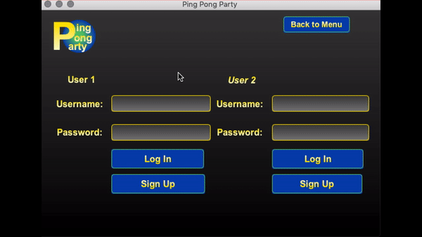

# CompetitionProject: Tuesday Team 6
### Team Members: 
- Amanda Smith
- Adam Dressel
- Oscar Garcia
- Alexander Thieler
- Jonathan Robertson
- Austin Nolz

### Instructions: How to Install
- In the Project Directory above, click on PingPongParty.zip, then click "Download" 
next to "History".
- Unzip or extract all files from the zip file, then open the project within IntelliJ by navigating
through File -> Open -> Downloads (or where you saved the Project) -> PingPongParty.
- Navigate to File -> Project Structure -> Project, then click on the Folder next to the 
Project Compiler Output text field, and select PingPongParty. Type "/out" at the end of the
file location and select OK.

### Ping Pong Party, a JavaFX Desktop Ping Pong Tracker

- Main Menu
	- User is given a list of options to choose from
	- Each button takes the user to a different menu corresponding to the option they chose		- These buttons launch a new fxml layout in the stage.
- 1v1 Login
	- Program displays two login prompts for each player.
	- Once both credentials are inputted and confirmed, the users are taken to the 1v1 game page
	- Users can also sign up which will bring them to a screen where they can create the account.
- 1v1 Game
	- Program displays game screen where users can input the finished match's final score.
	- Each user must verify their opponent's score before it is submitted to the database.
- Tournament Selection
	- The user is prompted with a form to create a tournament.
	- User enters data in forms and once submitted, this data is uploaded to the H2 database
	- The user can also view tournaments that have been created which allow them to see tournament information.
- View Tournament
	- View Tournament screen displays various information regarding the selected tournament
	- The name, date, time and number of users is displayed, along with a list of users.
	- Users can also join or leave the tournament they have selected.
	- Admin users have the ability to start the tournament they have selected.
- Statistics Menu
	- Program displays options for which the user can choose.
	- Each button leads to a particular table or view of statistics
- My Profile
	- My profile scene displays a user's statistical history from the database.
	- The match history view displays the opponent, whether the game resulted in a win or loss, points for and points against.
	- The tournament statistics view allows users to select a tournament and view its statistics.
	- Tournament statistics include each opponent played, win/loss, points for and points against.
- Search Profile
	- The search profile scene allows the user to look up other players in the database.
	- The user can choose a profile and view their corresponding statistics page.
	- All users are displayed in the username view.
- Leaderboard
	- The leaderboard view displays scores and matches for tournaments and 1v1.
	- The leaderboard view can show either individual match information or complete tournament information.
	- The overall leaderboard displays total stats in order for each user.
	- The tournament leaderboard displays similar stats for a particular tournament.
- Admin Login
	- If the user as a verified admin account, they can use this page to login.
	- The admin is granted the ability to delete existing tournaments, which other users are not capable of.	

### Technologies Used: 
- Java 8
- JavaFX
- Scenebuilder to build FXML files
- IntelliJ
- H2 local database

### SRS Link:

- https://eaglefgcu-my.sharepoint.com/:w:/g/personal/ajnolz8747_eagle_fgcu_edu/ETDD3UaRuARIvV88gvbwQkQB0iBixEvQkrBhfAg6AYnRZg?e=wkhfO9

### Class Diagram


### Prototype 1 Demo




### Prototype 2 Progress
- Documented all of our classes using JavaDocs
- Added FXML-tagged fields and methods within controllers to populate elements with data, and
set onAction calls from buttons.
- Set up local H2 database, and structured our data tables
- Set up Sign Up and Log In buttons to query the database for a 1v1 match.
- Added model classes for User, Tournament, and OneVOneStats.
- Set up the ScoreEntryController to add 1v1 match information to the database. 


### Prototype 2 Demo

[](http://www.youtube.com/watch?v=vahKhROjynQ "Prototype 2 Demo")

### Final Deliverable Video
[](https://www.youtube.com/watch?v=7U4HVyWR59w "Final Deliverable")


### Git Basics
- The master branch is only merged to after we have tested a feature within the dev branch and confirmed that it works.
- The dev branch is merged with only if the feature works as expected on the local version.

### How to Create a New Branch
- We will only create a new branch to add a feature and this is only done one time for each branch. 
- Performing these operations twice will create a duplicate.

```
git checkout dev         // Switch to branch named "dev"
git branch new_branch    // Creates new branch named "new_branch"
git checkout new_branch  // Switch to new_branch
```

### How to Merge a Branch
- When your local changes are working and you are ready to merge a branch with another we use this.

```
git checkout dev        // Switch to the destination named "dev"
git merge new_branch    // Merges new_branch changes to branch "dev"
```
